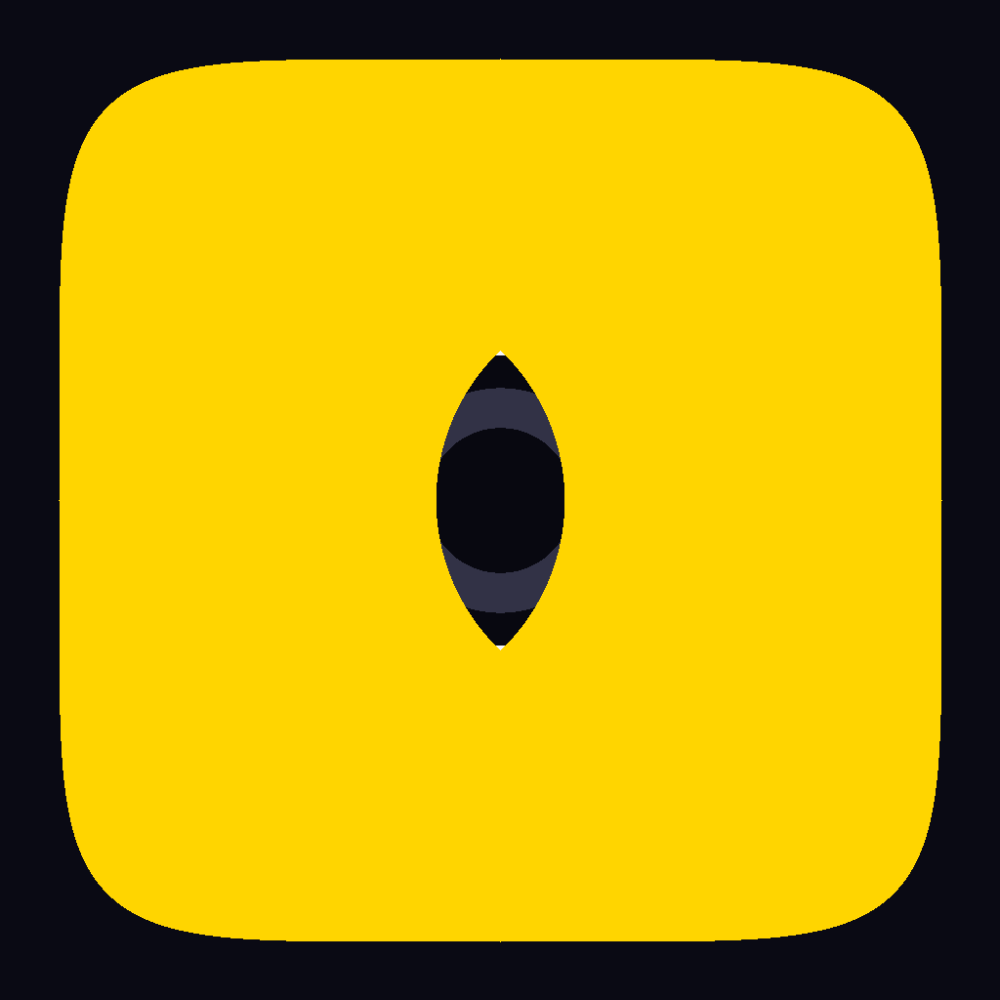

# NavEye — AI Blind Assistance System

<p align="center">
  
</p>

<p align="center">
  <strong>Real-time obstacle detection, face recognition, and voice control for visually impaired users</strong>
</p>

---

## 📖 What is NavEye?

NavEye is a Flutter-based Android assistive application built for visually impaired individuals. It uses the phone's rear camera combined with on-device AI models to:

- **Detect obstacles** in real time and announce them by name, direction, and distance via text-to-speech
- **Recognise known people** by face and announce their name when they appear in front of the camera
- **Accept voice commands** — say *Start*, *Stop*, *Who is this*, *Settings*, or *Help* to control the app hands-free
- **Run in the background** as a foreground service so detection continues even when the screen is off

---

## ✨ Key Features

| Feature | Details |
|---------|---------|
| 🎯 Object Detection | YOLOv8n ONNX model — detects 80 classes (people, vehicles, furniture, etc.) |
| 👤 Face Recognition | MobileFaceNet ONNX — ArcFace embeddings, avg-of-top-2 cosine matching |
| 🗣️ Voice Control | Double-tap mic → speak *Start / Stop / Who is this / Help / Settings / People* |
| 📢 Text-to-Speech | Always-English TTS singleton — announces obstacles, names, and directions |
| 🎤 Speech-to-Text | Shared STT singleton — prevents dual-mic conflicts across all screens |
| 🔔 Foreground Service | Detection runs as a persistent notification service — survives background kill |
| 👥 People Registration | Capture 3 face angles → save embedding → recognised on sight |
| ⚙️ Settings | Voice volume (Low / Medium / High), vibration, AI sensitivity, known people |
| 📱 Onboarding | First-run voice-guided setup — name, phone, emergency contact (all via mic) |

---

## 🏗️ Architecture

```
NavEye/
├── lib/
│   ├── main.dart                          # App entry point, foreground task init
│   ├── theme/
│   │   ├── app_theme.dart                 # Dark theme, colours, text styles
│   │   └── app_routes.dart                # Named route constants
│   ├── models/
│   │   └── person_model.dart              # Person entity (name, image, embedding)
│   ├── services/
│   │   ├── tts_service.dart               # TTS singleton (mute, announce, speakNow)
│   │   ├── shared_stt.dart                # STT singleton (prevents dual-mic conflicts)
│   │   ├── database_service.dart          # SQLite — persons & face embeddings
│   │   ├── detector_service.dart          # YOLOv8n ONNX inference + NMS
│   │   ├── face_recognition_service.dart  # MobileFaceNet embedding + cosine matching
│   │   ├── voice_command_service.dart     # STT-based voice command parser
│   │   ├── nav_eye_foreground_service.dart # Android foreground service wrapper
│   │   └── system_monitor_service.dart    # Battery & connectivity monitoring
│   ├── screens/
│   │   ├── main_ai/main_ai_screen.dart    # Camera + detection + voice UI (main screen)
│   │   ├── onboarding/                    # 3-step first-run setup wizard
│   │   ├── auth/user_profile_screen.dart  # User profile (name, phone, emergency contact)
│   │   ├── settings/settings_screen.dart  # Volume, vibration, AI sensitivity
│   │   ├── guidelines/                    # How-to guide with TTS read-aloud
│   │   └── people/                        # Register, list, and delete known faces
│   └── widgets/
│       └── common_widgets.dart            # VoiceTextField, PrimaryButton, LevelSelector
├── assets/
│   ├── models/
│   │   ├── detect.onnx                    # YOLOv8n ONNX (320×320 input, 80 classes)
│   │   ├── mobilefacenet.onnx             # MobileFaceNet (112×112 input, 512-dim output)
│   │   └── labelmap.txt                   # 80-class COCO label list
│   └── images/
│       └── app_icon.png                   # NavEye app icon
└── android/
    ├── app/src/main/AndroidManifest.xml   # Camera, mic, foreground service permissions
    └── app/src/main/res/                  # Adaptive launcher icons (all densities)
```

---

## 🤖 AI Models

### Object Detection — YOLOv8n ONNX
- **Input:** `[1, 3, 320, 320]` float32, pixel values normalised 0–1
- **Output:** `[1, 84, 2100]` — 80 class scores + 4 bounding box coordinates per anchor
- **Runtime:** ONNX Runtime for Android (`ort` package)
- **Post-processing:** Confidence threshold + Non-Maximum Suppression (NMS)
- **Speed:** ~120 ms/frame on Snapdragon 450 (Samsung Galaxy A30)

### Face Recognition — MobileFaceNet ONNX
- **Input:** `[1, 3, 112, 112]` float32, mean-std normalised RGB
- **Output:** `[1, 512]` L2-normalised ArcFace embedding vector
- **Matching strategy:** avg-of-top-2 cosine similarity across stored per-angle embeddings
- **Decision threshold:** 0.52 cosine similarity (rejects strangers, accepts genuine matches)
- **Registration:** 3 photos (front, slight left, slight right) → 1536-dim stored embedding

---

## 🔊 How Obstacle Announcements Work

```
Camera frame (YUV → RGB)
        ↓
  YOLOv8n ONNX inference
        ↓
  Filter by confidence (AI sensitivity setting: Low/Medium/High)
        ↓
  Estimate distance (bounding box height ratio heuristic)
        ↓
  Determine direction (left / centre / right based on box centre X)
        ↓
  For "person" class → Face recognition
  (ML Kit detects faces in full frame, filtered by YOLO person bbox)
        ↓
  TTS announcements (debounced, no repeats within cooldown window):
    "Table, left, 1.5 metres"
    "That is Kasun, centre, 2 metres"
    "Unknown person, right, 3 metres"
    "Warning! Car, centre, 0.8 metres — stop!"
```

---

## 🎤 Voice Commands

Activate by **tapping the SPEAK button** on the main screen. Wait for *"Listening — say start, stop, or help"* to finish speaking, then say your command:

| Command | What to Say | Action |
|---------|-------------|--------|
| **Start** | "Start", "Begin", "Go", "Detect" | Begin obstacle detection |
| **Stop** | "Stop", "Pause", "End", "Halt" | Pause detection |
| **Who is this** | "Who", "Identify", "Name", "Face" | Identify person in front |
| **Repeat** | "Repeat", "Again", "Say again" | Replay last announcement |
| **People** | "People", "Persons", "Contacts" | Open known people list |
| **Settings** | "Settings", "Options", "Configure" | Open settings screen |
| **Help** | "Help", "Commands", "Guide" | List all commands |

---

## 👥 Registering a Known Person

1. Go to **Settings → Known People → Add Person** (or say "People")
2. The app captures **3 face photos** with a 5-second auto-countdown:
   - Photo 1: Look straight ahead
   - Photo 2: Turn slightly left
   - Photo 3: Turn slightly right
3. Tap **Save Photos**, then enter the person's name using the **yellow mic button**
4. NavEye extracts a 512-dim face embedding from each photo
5. All 3 embeddings are stored. During recognition, the live face is scored against each stored 512-dim chunk separately — the **average of the top 2 scores** must exceed **0.52** cosine similarity for a match

> **Why 3 photos?** Different angles improve recognition accuracy when the person turns their head slightly. The avg-of-top-2 strategy requires at least 2 stored angles to agree, sharply reducing false matches.

---

## ⚙️ Settings Explained

| Setting | Options | Effect |
|---------|---------|--------|
| **Voice Volume** | Low / Medium / High | Controls TTS speaker volume (0.35 / 0.8 / 1.0) |
| **Vibration Feedback** | On / Off | Haptic pulse on each obstacle announcement |
| **AI Sensitivity** | Low / Medium / High | YOLO confidence threshold — High detects more objects but may produce false alerts in busy areas |
| **Known People** | Manage | Add, view, or delete registered faces |

---

## 📋 Requirements

- **Android 8.0+** (API 26 minimum)
- **Permissions:** Camera, Microphone, Foreground Service, Post Notifications
- **Internet:** Only for cloud STT (Google Speech API) — obstacle detection and face recognition run fully **offline**
- **Google app:** Required for cloud speech-to-text on Android

---

## 🛠️ Building from Source

```bash
# 1. Clone the repository
git clone https://github.com/Punujalokith/naveye.git
cd naveye

# 2. Install Flutter dependencies
flutter pub get

# 3. Build debug APK
flutter build apk --debug

# 4. Install to a connected Android device
flutter install --debug

# 5. Or run directly (keeps debug console open)
flutter run
```

> **Note:** The ONNX model files (`detect.onnx`, `mobilefacenet.onnx`) are included in the repository under `assets/models/`. No separate model download is needed.

---

## 🧪 Tested Devices

| Device | Android Version | Status |
|--------|----------------|--------|
| Samsung Galaxy A30 (SM-A305F) | Android 10 (API 29) | ✅ Full functionality |

---

## 📌 Key Technical Decisions & Bug Fixes

### TTS Singleton (factory constructor)
Multiple screens creating separate `FlutterTts` instances caused overlapping and echoing audio — `stop()` on one engine did not stop another engine's speech. A Dart factory constructor (`factory TtsService() => _instance`) ensures all screens share one engine.

### Shared STT Singleton
Android allows only one active `SpeechToText` session at a time. Multiple widgets initialising their own instances caused `error_busy` failures. All screens share `SharedStt.instance`.

### TTS→STT Audio Gap
When the mic button is tapped, TTS must fully finish speaking ("Listening — say start, stop, or help" takes ~1.1 s) before STT opens. Without a 1.3 s gap, the TTS audio caused immediate `error_audio` in STT, making the mic appear to open and close instantly.

### ONNX instead of TFLite
Migrated from TFLite to ONNX Runtime because:
- YOLOv8 exports cleanly to ONNX with full NMS support
- MobileFaceNet was only available in ONNX format
- Single runtime for both models simplifies dependency management

### Face Recognition Threshold
The threshold was raised from **0.35 → 0.52** after testing revealed that strangers routinely scored 0.36–0.44 against registered faces, causing the wrong name to be announced. At 0.52, genuine matches (typically 0.55–0.85) are clearly above the threshold while impostors (typically 0.05–0.44) are reliably rejected.

### Full-Frame Face Detection
Previously, ML Kit received a pre-cropped region of the person bounding box for face detection. This caused missed detections when the crop was too small or misaligned. The fix passes the **full camera frame** to ML Kit and filters detected faces by whether their centre point falls within the YOLO person bounding box.

---

## 👨‍💻 Developer

**Punujalokith**
- GitHub: [@Punujalokith](https://github.com/Punujalokith)
- Email: shplpunuja@gmail.com

---

*NavEye — Seeing the world, one announcement at a time.*
